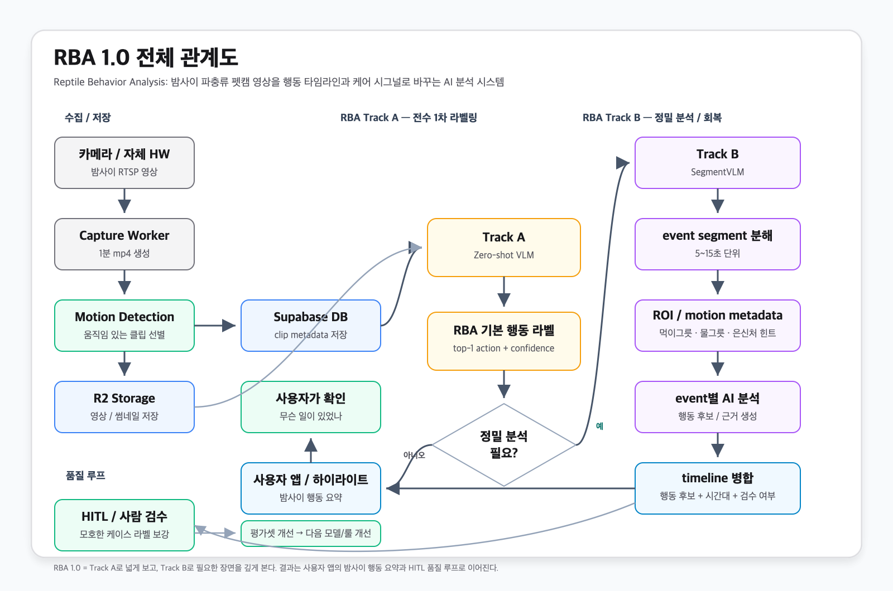
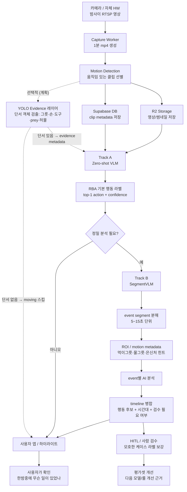

# RBA — Reptile Behavior Analysis

> 한밤중에 도마뱀이 무엇을 했는지, 긴 원본 영상을 사람이 뒤지지 않아도 알 수 있게 만드는 핵심 AI 파이프라인.

## 1. 한 줄 정의

이 회사의 AI 기술 핵심 이름은 **RBA (Reptile Behavior Analysis)** 이다.

RBA는 **카메라가 찍은 밤사이 파충류 영상을 행동 기록, 행동 타임라인, 케어 시그널로 바꾸는 AI 분석 시스템**이다.

단순히 영상을 저장하는 서비스가 아니라, 아래 흐름을 자동화한다.

```text
카메라 영상
→ 움직임 있는 구간 선별
→ Track A 기본 분석
→ 필요 시 Track B 정밀 분석
→ 행동 라벨 + 시간 정보 + 검수 대상 생성
→ 사용자가 "밤사이 무슨 일이 있었는지" 확인
```

결과적으로 사용자는 6~10시간짜리 야간 영상을 직접 보지 않고도, 앱에서 이런 식의 답을 얻는다.

```text
어젯밤 02:14 물그릇 근처에서 움직임
03:27 먹이 반응 후보
04:51 탈피 의심, 확인 필요
06:08 은신처 밖 활동 증가
```

## 2. 왜 사업적으로 중요한가

펫캠의 본질은 "영상 보기"가 아니라 **내가 못 본 시간의 반려동물 상태를 이해하는 것**이다.

일반 카메라는 영상을 남긴다. 이 제품은 영상을 **행동 단위 데이터**로 바꾼다. 이 차이가 사업적으로 크다.

- 사용자는 긴 영상을 돌려보는 시간을 줄인다.
- 희귀하지만 중요한 행동을 놓칠 가능성이 낮아진다.
- 먹이, 음수, 배변, 탈피, 활동량 같은 건강 시그널을 누적할 수 있다.
- 나중에는 개체별 생활 패턴, 이상 징후, 케어 리포트로 확장할 수 있다.

즉 RBA는 부가 기능이 아니라, **"펫캠을 건강/행동 인사이트 제품으로 바꾸는 엔진"**이다.

## 3. 전체 관계도





## 4. Track A — 운영 기준선

> **⚠️ 2026-06-12 피벗 — Gemini API 퇴역 (사용자 결정).** 아래 Gemini 기반 Track A는
> historical 기준선이다. fly VLM 워커는 셧다운 대상이고, 품질 연구는 **Claude 구독 트랙**
> (입력표현 연구 — [`specs/experiment-claude-montage-v2.md`](../specs/experiment-claude-montage-v2.md),
> production 목표 모델 = Sonnet 4.6)으로 이어진다. production 재가동 형태는 연구 수렴 후
> 별도 spec에서 결정. Gemini 마지막 정량 = `experiments/gemini-final-partial/`.

Track A는 피벗 전까지의 production baseline이었다.

```text
60초 motion clip
→ Gemini 2.5 Flash + v3.5 prompt  (← 퇴역, historical)
→ 행동 라벨 1개 생성
→ behavior_logs(source='vlm') 저장
```

Track A의 역할은 **모든 움직임 클립을 빠르고 싸게 1차 라벨링**하는 것이다.

장점:
- 구조가 단순하다.
- 비용이 낮다.
- 전체 클립에 적용하기 쉽다.
- 이미 production 워커로 운영 가능하다.

한계:
- 60초 클립에 행동이 여러 개 있어도 라벨은 하나다.
- 짧은 먹이 반응, 배변, 탈피 같은 중요한 행동이 이동/정지에 묻힐 수 있다.
- "언제 어떤 일이 있었는가"를 자세히 설명하기 어렵다.
- confidence만으로 자동 알림 여부를 결정하기엔 아직 불안정하다.

사업적으로 Track A는 **전수 자동 분류 레이어**다. 모든 영상을 사람이 보기 전, AI가 먼저 훑어주는 기본 생산라인이다.

## 5. Track B — 정밀 분석 / SegmentVLM

Track B는 차세대 실험 트랙이다. 이름은 **SegmentVLM**으로 고정한다.

Track B는 영상을 통째로 한 번 보지 않는다. 대신 움직임과 ROI를 기준으로 짧은 이벤트 조각으로 나눠서 본다.

```text
1~4분 영상 또는 mismatch clip
→ motion burst 탐지
→ 5~15초 event segment 생성
→ 먹이그릇/물그릇/은신처 같은 ROI metadata 결합
→ event별 VLM 분석
→ clip-level timeline으로 병합
```

Track B의 역할은 **Track A가 놓친 행동을 회복하고, 사용자가 이해할 수 있는 시간대별 설명을 만드는 것**이다.

장점:
- 짧은 행동을 더 잘 포착할 가능성이 있다.
- "03:27~03:39 물그릇 근처에서 혀 동작"처럼 시간대 설명이 가능하다.
- 모호한 클립을 사람 검수 대상으로 라우팅하기 좋다.
- 나중에 건강 리포트나 행동 패턴 분석으로 확장하기 좋다.

한계:
- event 수만큼 AI 호출이 늘어 비용이 올라갈 수 있다.
- 아직 production 저장 경로에 바로 쓰지 않는다.
- 최소 30~50개 이상의 대표/mismatch clip 비교 리포트가 필요하다.

사업적으로 Track B는 **정밀 판독 레이어**다. 모든 영상을 비싸게 분석하는 게 아니라, 중요한 후보만 더 자세히 보는 방식이다.

## 6. RBA 내부 Track A와 Track B의 역할 분담

| 구분 | Track A | Track B |
|---|---|---|
| 목적 | 전체 클립 1차 자동 라벨링 | 모호하거나 중요한 클립 정밀 분석 |
| 입력 | 60초 motion clip | 긴 영상 또는 Track A mismatch clip |
| 방식 | 전체 영상을 한 번 보고 top-1 라벨 | event segment로 쪼개고 timeline 병합 |
| 강점 | 싸고 빠르고 운영 안정적 | 설명 가능성, 회복 가능성, HITL 라우팅 |
| 약점 | 짧은 행동이 묻힐 수 있음 | 비용/복잡도 증가 |
| 현재 상태 | production baseline | side experiment |
| 사업적 의미 | 자동 분류 생산라인 | 고부가 정밀 분석 엔진 |

핵심은 둘 중 하나를 고르는 게 아니다.

```text
Track A = 넓게 본다
Track B = 필요한 곳을 깊게 본다
```

이 조합이 비용과 품질의 균형을 만든다.

## 6.5 YOLO Evidence 레이어 — 이벤트 단서 검출 (계획)

> 📌 **상태 (2026-06-08):** 학습 로드맵 완료, 구현 스펙·코드 없음. 사용자 트리거 대기. 이 섹션은 Track A/B를 **대체하지 않고**, 그 앞단에 붙는 **선택적 evidence 레이어**의 위치와 역할을 정의한다.

### 6.5.1 한 줄 정의 — YOLO는 분류기가 아니라 단서 검출기

직관적으로는 "YOLO로 moving을 걸러내자"가 떠오르지만, 이건 **잘못된 기대**다. YOLO는 행동 분류기가 아니라 **객체 검출기(object detector)** 다. 영상이 무슨 행동인지 직접 판단하지 못한다.

대신 YOLO가 잘하는 건 **프레임 안에서 이벤트 단서가 될 객체의 위치를 찾는 것**이다.

```text
mp4 clip
→ frame sampling
→ YOLO detect: gecko / food_dish / water_bowl / hide / human_hand / tool / prey / shed_skin
→ tracker: 같은 객체를 시간축으로 연결
→ evidence extractor: ROI 거리·체류시간·이동량·접촉 여부 계산
→ Track A/B 라우팅 + VLM/LLM 의미 판단
```

즉 목표는 "YOLO로 eating/drinking을 맞힌다"가 아니라, **"YOLO로 행동 판단에 필요한 좌표·시간 evidence와 라우팅 신호를 만든다"** 이다.

### 6.5.2 두 가지 효과 — 비용절감(직접) vs 정확도(간접)

YOLO evidence 레이어의 가치는 두 갈래로 명확히 구분해야 한다. 섞으면 과대평가한다.

| 효과 | 종류 | 메커니즘 | 확실성 |
|---|---|---|---|
| **비용 절감** | 직접 | 검출 객체가 게코뿐(그릇/손/도구/prey 없음)인 단순 이동 클립을 VLM 호출 전에 `moving`으로 스킵 | 높음 — 평가셋에서 `moving`이 약 31% |
| **정확도 향상** | 간접 (evidence-augmentation) | 그릇/손/도구 검출 결과를 VLM 입력 metadata로 같이 줘서 모호 케이스 라우팅·근거 보강 | 간접 — 정확도를 직접 올리는 게 아니라 잘못된 라우팅·근거 부족을 줄임 |

**중요:** YOLO는 정확도를 **직접** 끌어올리는 도구가 아니다. moving 스킵으로 **비용을 줄이고**, evidence metadata로 VLM의 라우팅·근거를 **보강**할 뿐이다. "YOLO 붙이면 정확도 N%p 오른다"는 식의 약속은 하지 않는다.

### 6.5.3 병목은 YOLO 밖에 있다 — 3층 역할 분담

2026-06-08 Claude 정성 평가가 이 역할 분담을 입증했다. **정지 프레임(contact sheet)으로 풀리는 행동**과 **영상 시간축이 필요한 행동**이 갈린다.

- `moving` / `hand_feeding`(사람 손·그릇 같은 큰 객체가 화면에 보임) → 정지 프레임으로 90%대 가능.
- `drinking`(혀-물 접촉 순간) / `shedding`(허물 벗는 동작) / `defecating`(배변 순간) 같은 **미세 행동** → 검출 가능한 "객체"가 아니라 **시간축 위의 미세 동작**이라 YOLO로 안 잡힌다.

따라서 분석 파이프라인은 **3층**으로 나뉜다. 각 층이 잘하는 영역이 다르다.

```text
[1층] YOLO evidence 레이어   = 단서 객체 검출 (그릇·손·도구·prey·허물 위치)
        ↓ (좌표·시간 evidence + 라우팅 신호)
[2층] VLM 판정 (Track A/B)   = 정지 프레임/세그먼트로 풀리는 행동 분류 (moving, hand_feeding 등)
        ↓ (미세행동 의심 → 시간축 필요)
[3층] 시간축 모델 / HITL     = 미세 접촉·미세 동작 (drinking 혀접촉, shedding, defecating)
                               → VideoMAE 류 video model / Gemini full-video / 사람 검수
```

핵심: YOLO를 붙여도 미세행동 병목은 **그대로 남는다**. 그건 YOLO(검출)의 문제가 아니라 정보가 시간축에 있기 때문이고, 3층(시간축 모델·HITL)의 영역이다. YOLO는 1층에서 **싼 거르기 + 단서 제공**만 책임진다.

### 6.5.4 Track A/B와의 연결 — 앞단 라우터

YOLO evidence 레이어는 기존 Track A/B 구조를 건드리지 않는다. **두 트랙 앞단에 붙는 선택적 전처리/라우터**다.

```text
motion clip
→ [YOLO evidence 레이어]  ← 신규 (선택적)
    ├─ 단서 객체 없음(게코만) → moving 스킵 (Track A 호출 안 함, 비용 0)
    └─ 단서 객체 있음(그릇/손/도구/prey/허물)
         → evidence metadata 생성
         → Track A (Zero-shot VLM) — metadata를 user input에 동봉
              └─ 모호/P0 후보 → Track B (SegmentVLM) — event ROI metadata로 재사용
```

- Track B의 ROI metadata([`../specs/experiment-event-segment-vlm.md`](../specs/experiment-event-segment-vlm.md) §4.4)는 지금 **카메라별 수동 좌표**로 시작한다. YOLO가 검증되면 이 ROI/단서 좌표를 **자동 생성**하는 공급원이 될 수 있다. 다만 그릇은 카메라 고정이라 수동 좌표가 더 안정적일 수 있어, YOLO 자동화는 게코/손/도구/prey 같은 **움직이는 단서** 우선이 현실적이다.
- 라우팅 신호는 Track B의 selective fallback trigger(§10.4)와 합쳐진다. "그릇 근처 체류 + 입 움직임" 같은 evidence가 high-value 후보 라우팅의 근거가 된다.

### 6.5.5 데이터·검출 품질 게이트 — custom 학습 필요

pretrained YOLO를 그대로 쓰면 안 된다. 이미 폐기된 PoC가 그 한계를 보여줬다.

- **OWLv2 PoC 검출 47.5% 실패 교훈**([`../specs/experiment-tracking-vlm-input.md`](../specs/experiment-tracking-vlm-input.md) 폐기): 운영 환경(IR 야간·위장·거리·가림)에서 pretrained open-vocabulary detector가 게코를 절반도 못 잡았다. distribution mismatch.
- 따라서 **게코 fine-tune이 필요**하고, 학습 데이터는 **운영 환경 그대로**여야 한다. "잘 나온 사진"만 모으면 또 mismatch.
- **`storage/dataset-203/`** (203건 GT 라벨 + 원본 영상)이 fine-tune 학습 데이터 후보로 적합하다. 운영 분포를 그대로 담은 야간·위장·다양한 거리의 게코 클립이라, OWLv2가 실패한 그 분포에서 custom detector를 학습할 수 있다.
- **detector 품질 게이트 먼저**: downstream evidence가 의미 있으려면 게코 검출 recall이 최소 기준(예: 80%+)을 넘어야 한다. 게이트 통과 전에는 evidence 레이어를 파이프라인에 붙이지 않는다.

### 6.5.6 진행 순서 / 라이선스 / 실행 위치

- **진행 순서(합의):** 사용자가 ① 운영 환경 게코 영상 ② 게코 frame ③ YOLO 공부 완료 후 "YOLO 하자"로 트리거 → ⓐ `specs/experiment-yolo-evidence-layer.md` 작성 → ⓑ **Phase 3(pretrained 검출 한계 재확인, 비용 0) 먼저** → custom 학습(Phase 4-5)은 그 다음.
- **실행 위치:** self-hosted R&D 성격이라 [`../petcam-rba-worker`](../petcam-rba-worker)(Mac mini) 영역으로 검토. production SLA 경로가 아니라 side worker.
- **라이선스 주의:** Ultralytics YOLO는 **AGPL-3.0**. 상용 배포 전 라이선스(상용 라이선스 구매 또는 AGPL 호환 대체 detector) 확인 필요.
- **연관 문서:** 학습 로드맵 [`learning/yolo-video-analysis-study-plan.md`](learning/yolo-video-analysis-study-plan.md), 메모리 `project_yolo_evidence_layer_status`, Track B 설계 [`../specs/experiment-event-segment-vlm.md`](../specs/experiment-event-segment-vlm.md).

## 7. 사용자가 체감하는 최종 경험

사용자는 AI 파이프라인의 복잡한 내부를 보지 않는다. 사용자가 보는 건 간단해야 한다.

```text
밤사이 요약
- 총 활동 시간: 42분
- 주요 행동: 이동, 물그릇 접근, 먹이 반응 후보
- 확인 필요: 탈피 의심 1건
- 하이라이트: 5개
```

클립 상세에서는 이런 식으로 보인다.

```text
03:27:12 - 03:27:44
행동 후보: drinking
근거: 물그릇 ROI 근처에서 반복적인 머리/혀 움직임
상태: AI 자동 분석, 사람 확인 권장
```

사용자 입장에서 가치는 명확하다.

- 어젯밤 활동이 있었는지 알 수 있다.
- 밥을 먹었는지, 물을 마셨는지, 배변/탈피가 있었는지 확인할 수 있다.
- 중요한 장면만 빠르게 볼 수 있다.
- 불안할 때 원본 영상을 직접 뒤지는 시간을 줄인다.

## 8. 데이터가 쌓일수록 생기는 방어력

이 파이프라인의 장기 가치는 라벨 데이터에 있다.

Track A는 매일 대량의 자동 라벨을 만든다. Track B와 HITL 검수는 그중 어려운 케이스를 골라 품질 높은 라벨로 바꾼다.

```text
자동 분석
→ 모호 케이스 선별
→ 사람 검수
→ GT 라벨 축적
→ 평가셋 개선
→ 다음 분석 전략 개선
```

이 루프가 쌓이면 단순 기능 복제가 어려워진다. 카메라 앱은 따라 만들 수 있어도, **도마뱀 행동 영상과 라벨이 누적된 데이터 루프**는 시간이 필요하다.

## 9. 사업 설명용 요약

우리는 도마뱀 펫캠 영상을 단순 저장하지 않는다.

카메라가 밤새 수집한 원본 영상을 **RBA (Reptile Behavior Analysis)** 가 먼저 훑고, 움직임 있는 구간을 행동 라벨로 바꾸고, 중요한 장면은 세그먼트 단위로 정밀 분석한다. 그 결과 사용자는 긴 영상을 보지 않아도 "밤사이 내 도마뱀이 무엇을 했는지"를 시간대별로 이해할 수 있다.

Track A는 전체 영상을 저비용으로 자동 라벨링하는 운영 기준선이고, Track B는 모호하거나 중요한 장면을 더 깊게 분석하는 SegmentVLM 전략이다. 둘을 결합하면 비용은 통제하면서도, 먹이·음수·배변·탈피 같은 건강 시그널을 놓치지 않는 방향으로 발전할 수 있다.

이 파이프라인은 앞으로 활동량 리포트, 이상 행동 탐지, 케어 알림, 개체별 생활 패턴 분석으로 확장되는 회사의 핵심 AI 자산이다.

## 10. 1만 명 이상 production 로드맵

### 10.1 비용 산정 가정

아래 숫자는 planning estimate 다. 실제 비용은 카메라 해상도, motion clip 수, 보관 기간, 모델 단가, Track B fallback 비율에 따라 달라진다.

기본 가정:

| 항목 | 기준값 |
|---|---:|
| 사용자당 카메라 | 1대 |
| 사용자당 motion clip | 50개 / 일 |
| clip 길이 | 60초 |
| 평균 mp4 크기 | 3MB |
| 영상 보관 기간 | 30일 |
| Track A 비용 | clip당 약 $0.001 현재 추정 |
| Track B 비용 | fallback clip당 약 $0.003~$0.008 |
| Track B 실행률 | 전체 clip의 5~15% |

공개 가격 기준:
- Gemini 2.5 Flash: input $0.30 / 1M tokens, output $2.50 / 1M tokens. Batch는 input $0.15, output $1.25.
- Gemini 2.5 Flash-Lite: input $0.10 / 1M tokens, output $0.40 / 1M tokens. Batch는 input $0.05, output $0.20.
- Cloudflare R2 standard storage는 공식 예시 기준 약 $0.015 / GB-month, egress 비용 없음. 요청 수 비용은 별도.

사용자 1명당 30일 저장량:

```text
50 clips/day × 3MB × 30 days = 약 4.5GB/user
R2 storage ≈ 4.5GB × $0.015 = 약 $0.07/user/month
```

즉 1만 명 기준 storage 자체는 약 $675/month 수준이고, 진짜 비용 중심은 **AI inference** 다.

### 10.2 Phase별 목표

| Phase | 가용 사용자 | 제품 상태 | Track A | Track B | 월 비용 대략 | 핵심 목표 |
|---|---:|---|---|---|---:|---|
| Phase 0 | 1~10명 | 내부 실험 | v3.5 baseline 수동/반자동 | 샘플 실험 | $50~$300 | RBA 구조 검증 |
| Phase 1 | 10~100명 | 베타 | 모든 motion clip 자동 라벨 | owner/mismatch 위주 shadow | $300~$1,500 | 라벨 UX + 비용 계측 |
| Phase 2 | 100~1,000명 | 유료 베타 | 안정 워커 + 회귀 가드 | selective fallback 10~15% | $1,500~$6,000 | HITL 루프 + 요약 UX |
| Phase 3 | 1,000~10,000명 | production scale | autoscale + batch/Lite 라우팅 | 5~8% 정밀 분석 | $8,000~$30,000 | 단위경제 통제 |
| Phase 4 | 10,000명+ | RBA 2.x/3.x | 저비용 전수 분석 | 자체 서버/local/fine-tuned 모델 혼합 | $0.7~$1.5/user/month 목표 | proprietary model moat |

Phase 3의 비용 범위가 넓은 이유:

```text
1만 명 × 50 clips/day × 30일 = 1,500만 Track A clips/month

외부 Gemini Flash 중심:
Track A: 1,500만 × $0.001 ≈ $15,000/month
Track B: 5~8% × $0.005 ≈ $3,750~$6,000/month
Storage/R2/API/DB/worker: $1,000~$4,000/month
총합: 대략 $20,000~$30,000/month

최적화 후 목표:
Track A를 Flash-Lite/Batch/frame sampling으로 clip당 $0.0003~$0.0006
Track B를 5% 이하 + 자체 서버/local batch로 제한
총합: 대략 $8,000~$15,000/month
```

### 10.3 Phase 1 — RBA 1.0 베타 제품화

목표:
- Track A를 모든 motion clip에 안정 적용한다.
- 사용자는 앱에서 자동 라벨, 하이라이트, 밤사이 요약을 본다.
- owner는 라벨링 웹에서 RBA 결과와 사람 라벨을 비교한다.

해야 할 일:
- v3.5 prompt는 production baseline으로 고정.
- clip당 비용, latency, 실패율, retry 수를 저장.
- `behavior_logs`에 model version / prompt version / cost metadata를 남긴다.
- Flutter 앱에 `RBA 1.0 자동 분석` chip, 하이라이트 탭, 밤사이 요약을 노출한다.
- HITL 라벨링을 통해 GT 데이터를 계속 쌓는다.

성공 기준:
- 사용자 100명까지 운영 가능.
- 사용자당 월 AI+storage 비용 $1 이하로 측정.
- Track A 실패 clip 자동 재처리.
- v3.5 85.5% floor 회귀 가드 유지.

### 10.4 Phase 2 — RBA 1.5 Selective SegmentVLM

목표:
- Track B를 전체 영상에 돌리지 않는다.
- Track A가 애매하거나 중요한 clip만 Track B로 보낸다.

Track B trigger:
- Track A confidence 낮음.
- `feeding`, `defecating`, `shedding`, `eating_prey` 같은 high-value 행동 후보.
- Track A가 `moving`이라고 했지만 motion burst가 큰 clip.
- 사용자가 flag한 clip.
- 특정 시간대/ROI에서 반복 발생한 이상 행동.

구조:

```text
Track A 결과
→ risk router
→ 확실하면 사용자 앱 반영
→ 모호하거나 중요하면 Track B
→ Track B timeline 생성
→ 필요 시 HITL 검수
```

성공 기준:
- 사용자 1,000명까지 운영 가능.
- Track B 실행률 10~15% 이하.
- P0 행동 recall 개선.
- 사람 검수 큐가 감당 가능한 수준으로 유지.

### 10.5 Phase 3 — 1만 명 production scale

목표:
- 하루 50만 개 수준의 Track A clip을 처리한다.
- 비용 폭주 없이 중요한 장면만 Track B로 정밀 분석한다.

필요한 시스템:
- 큐 분리: `track_a_pending`, `track_b_pending`, `hitl_pending`.
- worker autoscaling: 낮에는 저속, 밤/새벽 업로드 피크에 확장.
- per-user budget: 무료/유료 플랜별 분석량 제한.
- priority queue: P0 후보, 사용자 flag, 최근 clip 우선.
- model routing: Flash / Flash-Lite / batch / local worker 선택.
- dead-letter queue: 실패 clip 격리와 재처리.
- observability: cost/user, cost/clip, failure rate, p95 latency, fallback rate.

비용 전략:
- Track A는 가능한 한 batch 또는 Flash-Lite 후보를 평가한다.
- Track B는 5~8% 이하로 제한한다.
- 모든 clip을 정밀 분석하지 않고, high-value 후보만 깊게 본다.
- 영상 원본 보관 기간을 플랜별로 차등화한다.

### 10.6 Phase 4 — 자체 서버 / local LLM / fine-tuning

목표:
- 외부 VLM API 의존도를 줄이고, proprietary reptile behavior dataset을 모델 성능으로 전환한다.

맥미니 / 자체 서버 역할:
- Track B shadow 분석.
- SegmentVLM batch 처리.
- contact sheet / keyframe / ROI metadata 생성.
- local VLM, Claude/Codex CLI, fine-tuned model 비교 실험.
- **YOLO evidence 레이어(§6.5) custom 학습·검출** — `storage/dataset-203/` 로 게코 fine-tune, detector 품질 게이트 검증, ROI/단서 좌표 자동 생성.
- GT dataset 정제와 hard negative mining.

주의:
- 맥미니 1대가 1만 명 production 실시간 분석을 전부 감당하는 구조는 아니다.
- 초기 역할은 **production SLA 경로**가 아니라 **정밀 분석 / 비용 절감 / 모델 개선용 side worker** 가 맞다.
- 검증된 후 class별로 production 경로에 승격한다.

fine-tuning 방향:
- "100% 정확도"를 외부 약속으로 말하지 않는다.
- 내부 목표는 사람 검수 기준에 최대한 근접하는 species-specific behavior model이다.
- 우선순위는 feeding, drinking, defecating, shedding, eating_prey 같은 high-value class.
- Track B가 만든 event-level dataset과 HITL 라벨이 fine-tuning 재료가 된다.

### 10.7 투자자용 요약

RBA는 모든 영상을 비싸게 분석하는 시스템이 아니다. Track A가 전체 clip을 저비용으로 넓게 보고, Track B가 중요한 후보만 깊게 본다. 그 결과 사용자는 밤사이 행동 요약을 받고, 회사는 HITL 검수 데이터를 축적한다.

1만 명 규모에서는 AI inference가 핵심 비용이므로, Flash/Flash-Lite/Batch/local worker를 섞는 model routing과 selective fallback이 단위경제를 결정한다. 장기적으로는 자체 서버와 fine-tuning을 통해 외부 API 비용을 줄이고, 도마뱀 행동 데이터셋 자체를 회사의 방어 가능한 AI 자산으로 만든다.
